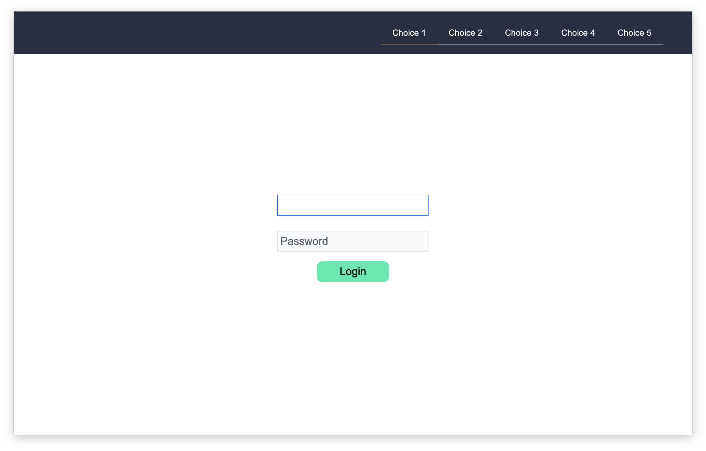
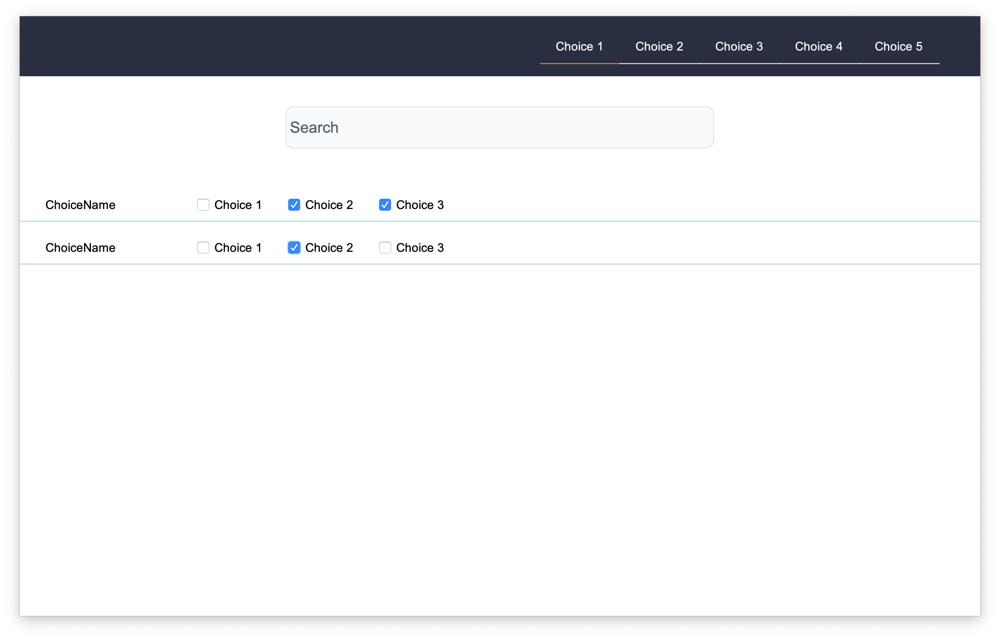
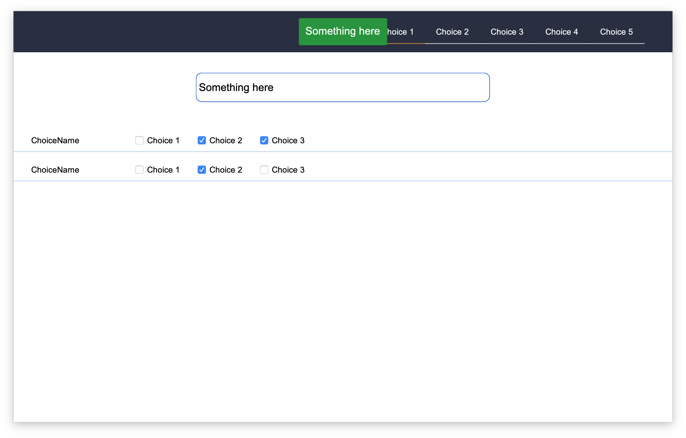
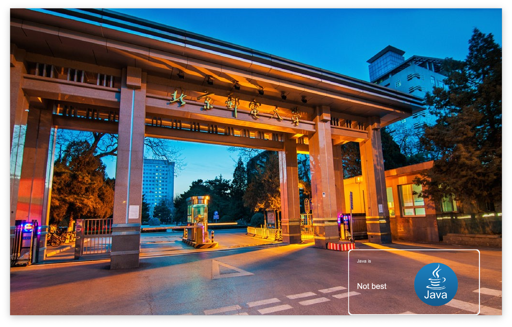

# LiangrunSwingUI
This overrides some of the components in java.swing. It is for the course project, so some of them may not be well designed for reuse. I will update it when I have time.

I give 3 examples for the demonstration.

1.

It shows the usage of TextButton, Menubar, InputText, Password

2.

Demo2 shows the usage of FilterBox and MyReminder. Once you enter something and press the 'return' of your keyboard, you will see a reminder coming from top to down.

3.

Demo3 shows the usage of Picture and Sticker. The picture can automatically fit into the size you give without distortion.

Note: You have to change the path in the Demo3.java

